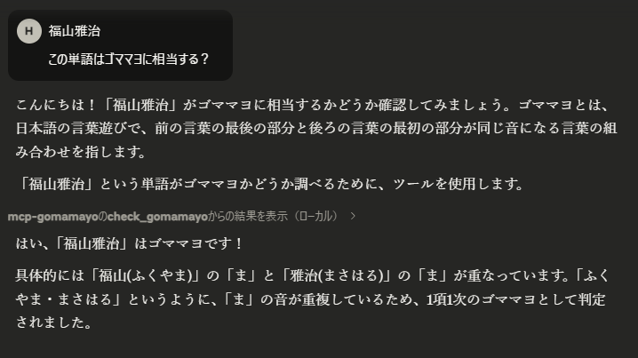

# mcp-gomamayo

<!-- バッジ (必要に応じて実際のバッジURLに置き換えてください) -->
[](https://golang.org/)
[](https://github.com/modelcontextprotocol/mcp)
[](LICENSE)

テキスト中の「ゴママヨ」構文をチェックするための [Model Context Protocol (MCP)](https://github.com/modelcontextprotocol/specification) サーバーです。 

## 目次

- [セットアップ](#セットアップ)
- [Claude Desktop での利用](#claude-desktop-での利用)
  - [MCPサーバー設定](#mcpサーバー設定)
- [使い方](#使い方)

## セットアップ

```bash
git clone https://github.com/mizakahk/mcp-gomamayo.git
cd mcp-gomamayo
task build
```

## Claude Desktop での利用

### MCPサーバー設定

`claude_desktop_config.json` に以下の設定を追加します

1.  **WSL上で起動:**
    ```json
    {
      "mcpServers": {
          "mcp-gomamayo": {
              "command": "wsl",
              "args": [
                  "bash",
                  "-ic",
                  "~/mcp-gomamayo/bin/mcp-gomamayo"
              ],
              "env": {}
          }
      }
    }
    ```

設定ファイルを保存した後、Claude Desktop を再起動すると、`gomamayo-checker` が利用可能になります。

## 使い方

MCP サーバーが Claude Desktop で有効になると、`check_gomamayo` ツールを使用してテキストのゴママヨ構文をチェックできます。

**例 「福山雅治」の判定:**


